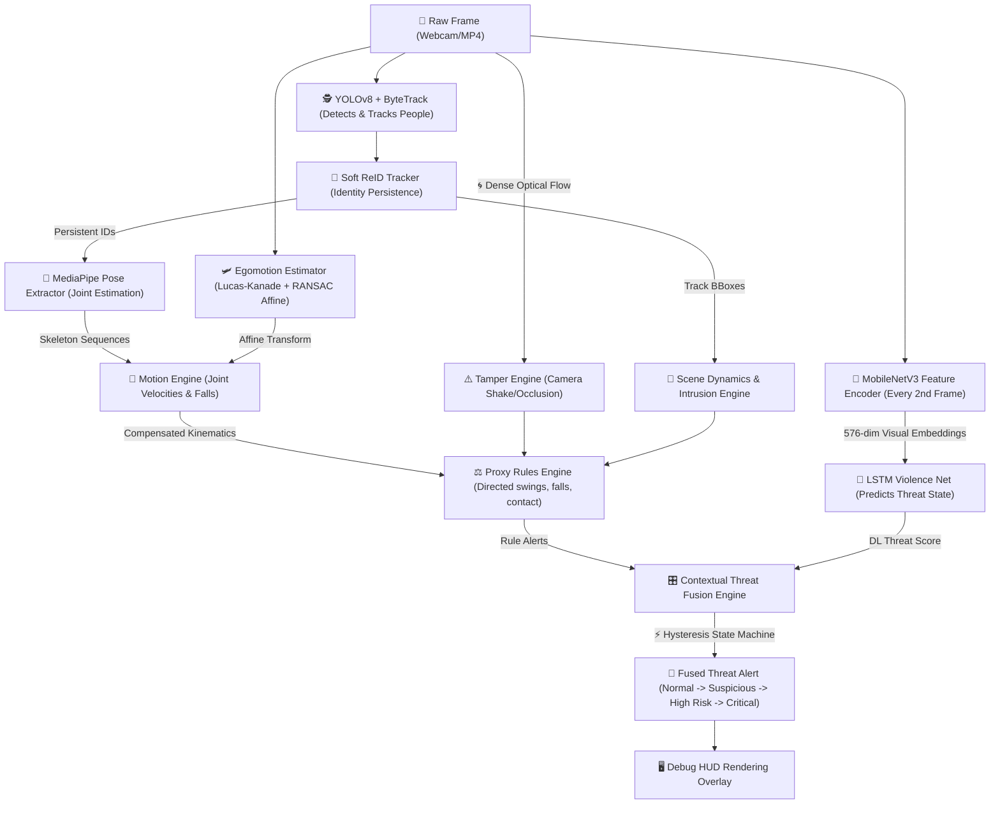

# 🕶️ PROJECT 007: Real-Time Threat Analysis & Violence Detection Pipeline
> **CLASSIFIED INFORMATION:** For the eyes of Agent 007 and authorized developers only. If you are a rogue agent or a simple webcam hack, close this tab immediately or face automated laser-guided counter-intrusion!

Welcome to **PROJECT 007**—the ultimate, state-of-the-art surveillance suite that doesn't just watch; it *thinks*, *calculates joint angles*, *feels camera shake*, *detects suspicious intrusion*, and leverages a fully trained Deep Learning LSTM neural network to flag fights and high-energy chaos before they even hit the news!

---

## 🛠️ System Architecture & Logic Flow

Here is how a raw pixel frame from your webcam goes from harmless video to high-alert espionage defense:



---

## 🧐 Keen & Pure Logic Points: The Secret Sauce

### 1. The Detectives: YOLOv8 + ByteTrack
We don't just detect people; we assign them unique IDs and track them persistently across the room. Even if they duck behind a pillar or do a backflip, ByteTrack keeps them tagged.

### 2. The Bone Reader: MediaPipe Pose Worker
We extract a complete 3D skeleton for every person detected. We skip every other frame (`POSE_EVERY_N_FRAMES = 2`) to ensure your CPU doesn't catch fire, allowing high-frequency processing of up to 25 FPS!

### 3. The Kinematic Calculator: Motion Engine
For every track, we compute complex physical features inside a rolling buffer (`BUFFER_SIZE = 16`):
- **Arm Velocity**: Are they waving high-speed fists?
- **Body Displacement**: Are they running towards someone?
- **Fall Score**: Has their torso angle changed and hips dropped relative to their ankles? 
- **Approach Velocity**: Are two tracking IDs closing the gap at extreme speeds?

### 4. The World Observers: Tamper & Intrusion
- **Tamper**: Computes global optical flow magnitudes. If the camera starts shaking violently (like a fight or seismic rumble) or gets covered (darkness/occlusion), the system goes into tamper alert.
- **Intrusion**: Defines virtual polygon zones. If tracking coordinates cross into these restricted regions, alarms trigger instantly.

### 5. The Deep Learning Brain: MobileNetV3 + LSTM
Instead of just relying on rules, we load **MobileNetV3-Small** (ImageNet pretrained, stripped classification head) to convert every frame into a lightweight 576-dim visual descriptor.
We then concatenate the visual embedding with motion and scene metrics into a **582-dimensional vector** and feed it into a temporal **LSTM Network** (128 hidden nodes) to predict if the scene is `NORMAL`, `SUSPICIOUS`, `HIGH_RISK`, or `CRITICAL`.

### 6. The Cool-Headed Evaluator: Contextual Threat Fusion & Hysteresis
To prevent chaotic false alarms, rule alerts and DL outputs enter a **Hysteresis State Machine**:
- An alert is only elevated if threat scores exceed high thresholds for a minimum dwell time (e.g., > 2.0s).
- Alerts decay slowly over time to ensure that brief occlusion doesn't clear a high-risk event immediately.

### 7. The Memory Keeper: Soft ReID & Scene-Centric Fusion (P5.1)
ByteTrack occasionally fragments identities during occlusion or rapid motion. Our **Soft ReID Tracker** solves this:
- Maintains a ghost cache of recently lost tracks (up to 3 seconds).
- Matches new detections using combined **HSV color histograms** + **geometric dynamics** (centroid distance, velocity cosine).
- Similarity above `0.65` restores the original persistent ID, preventing evidence loss.
- **Scene-Centric Fusion**: Risk accumulates at the **scene level**, not per-track-pair, so evidence survives ID swaps.

### 8. The Stabilizer: Egomotion Compensation (P6.0-A)
For drone deployment, camera motion (translation, rotation, vibration) would corrupt all motion features. Our **Egomotion Estimator** fixes this:
- Tracks up to 150 background feature points using **Lucas-Kanade** sparse optical flow.
- Masks out all person bounding boxes to prevent foreground contamination.
- Computes a **RANSAC-based 2D affine transform** (translation + rotation) mapping previous frame to current.
- The affine matrix is fed into the **Motion Engine**, which projects previous keypoint/centroid positions before computing velocity deltas.
- Result: arm velocity, body displacement, and approach velocity now measure **real human movement**, not camera shake.

---

## 🖥️ System Specifications & Requirements

To run this without turning your PC into a space heater:

| Component | Minimum Specification | Recommended Specification |
|-----------|-----------------------|---------------------------|
| **CPU** | AMD Ryzen 5 / Intel Core i5 | Intel Core i7 / AMD Ryzen 7 (Multi-core) |
| **GPU** | NVIDIA GTX 1650 (CUDA Support) | NVIDIA RTX 3060 or higher (4GB+ VRAM) |
| **RAM** | 8 GB | 16 GB |
| **OS** | Windows 10 / 11 | Windows 11 / Linux (Ubuntu 22.04) |
| **Webcam**| 480p capable | 720p/1080p high FPS webcam |

---

## 🚀 Pre-install & Complete Setup Guide

### Step 1: Clone or Open the Workspace
Ensure you are inside the `project_007/` directory.

### Step 2: Set Up Python Virtual Environment
We want a clean sandbox so we don't mess up your system packages:
```powershell
python -m venv venv
# Activate on Windows:
venv\Scripts\activate
# Activate on Linux/macOS:
# source venv/bin/activate
```

### Step 3: Install PyTorch with CUDA Support
Since we run both YOLO and MobileNetV3, we need GPU acceleration! Install PyTorch compiled with CUDA matching your NVIDIA drivers:
```powershell
# For CUDA 12.1 (Standard for RTX GPUs)
pip install torch torchvision --index-url https://download.pytorch.org/whl/cu121
```

### Step 4: Install Remaining Dependencies
```powershell
pip install -r requirements.txt
```

---

## 🎮 How to Play Agent 007: Command Reference

### 1. Run Live Webcam Surveillance
Activate your webcam and run the real-time AI pipeline:
```powershell
$env:PYTHONPATH="."
python main.py
```
*Controls:* Press **`q`** to exit, **`r`** to record, or check the screen HUD overlay!

### 2. Train the Deep Learning Brain (LSTM)
Annotated your videos? Let's train the LSTM Violence Detector model:
```powershell
$env:PYTHONPATH="."
python -m training.train_violence_classifier --epochs 20 --lr 0.001 --batch-size 32
```
*Note:* This scans your annotated files under `dataset/annotations/`, extracts joint kinematic + visual features, trains the model, and saves the best weights to `models/saved/violence_classifier.pt`.

### 3. Replay & Evaluate a Mission File
Run a deterministic evaluation on a recorded video dataset with detailed HUD overlays:
```powershell
$env:PYTHONPATH="."
python -m evaluation.replay_engine dataset/interaction/fight_test.mp4 interaction
```
*Controls in Replay mode:*
*   `Space` : Pause / Resume playback
*   `N` : Step forward by one frame (when paused)
*   `[` / `]` : Decrease/Increase speed (0.25x to 4.0x)
*   `Q` : Quit replay

### 4. Run Per-Class Classifier Report
Analyze classification metrics across different categories (normal, tamper, intrusion, high_energy_interaction):
```powershell
$env:PYTHONPATH="."
python -m evaluation.class_metrics
```

### 5. Compare Baseline Performance
Run a 3-way benchmark evaluation comparing (A) Rules-only, (B) ML-only, and (C) Hybrid Fusion models:
```powershell
$env:PYTHONPATH="."
python -m evaluation.p4_comparison
```

### 6. Run Drone Egomotion Compensation Audit
Validate that the egomotion compensation layer successfully filters out camera motion from velocity features:
```powershell
$env:PYTHONPATH="."
python -m evaluation.drone_motion_audit
```
*This compares raw vs. compensated arm/body/approach velocities across 5 synthetic drone motion profiles (hovering, slow pan, fast yaw, wind jitter, overhead view).*

---

## 🛠️ Troubleshooting for Rookie Agents

*   **`CUDA not available / CPU Fallback Warning`**
    Make sure you have your NVIDIA drivers up to date, and you ran the PyTorch CUDA installation command in Step 3.
*   **`No webcam feed / Index Error`**
    Open `config.py` and adjust `CAMERA_INDEX` (usually `0` for integrated webcams, `1` or `2` for USB webcams).
*   **`FPS is too low!`**
    No worries! Open `config.py` and increase `POSE_EVERY_N_FRAMES` to `3` or `4`, or decrease `MAX_POSE_CROP` to `192` to process smaller image patches!
